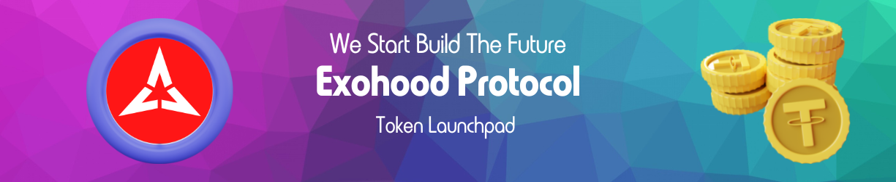

# Create and Issue your own Token 🪙

Choose between the Ethereum network, BNB Chain, Polygon, or Tron to create and deploy your smart contract on a project, company, art, music, asset or a game. You do not need programming knowledge; you only have to follow the instructions below.

# Token Intructions ⚠️

How to create and deploy a smart contract on Ethereum, BNB Chain, Polygon, TRON with Exohood Token Launchpad

1. Choose the token offering pack and pay it. Remember the payment is the same network you choose. For example: if you choose Ethereum token the payment is made using  USDT in Ethereum network.

2. Create smart contract:

    a. Choose the name of your token: a name for the project or company without spaces, usually 5-25 symbols. Lower and uppercase.
    
    b. Token owner: is the same address in which you make the payment.
    
    c. Token symbol: Usually 3-4 Letters like ETH, BTC, EXO, etc., Please check that it´s unique before deploying the contract. 
    
    d. Decimals: Defines the number of decimals for the token. 0-50 numerals are accepted. 18 are mainly used.
    
    e. Token supply: Is the quantity you mint, can be reserved as the tokens for the Team, Rewards or Investors.
    
    f. Token allocations Address: Is the address in which you supply your tokens

# Deploy your Contract 🚀

Tips💡:

a. Scan Verification: We sent the souce code verification providing transparency for users interacting with smart contracts.

b. White label: Contract from a black address, with no metion and reference to Exohood Deployer.

c. Deploy Contract: Your contract is sent to our deployer platform to validate it. This process takes between 3-5 hours.

d. Token allocations Address: please use a different address. It shouldn't be the same as your token owner address. For example, you make another address in Metamask or TrustWallet.

# Disclaimer

Exohood assumes no responsibility concerning the token creation, the token owner is responsible for the security, accuracy, sales or use of third-party.
